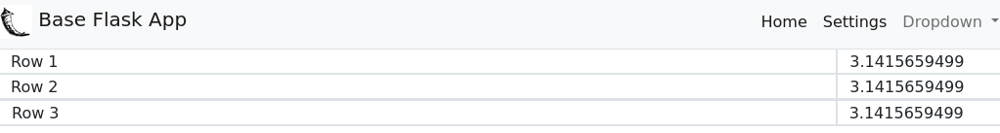

# A basic Flask app that uses Bootstrap and a table layout

This is a very simple **template** style Flask app that creates a menubar and an empty table layout using **Bootstrap**. 

I wrote this so I could re-use it as needed when writing tabular Flask web apps.

### Example Screenshot

